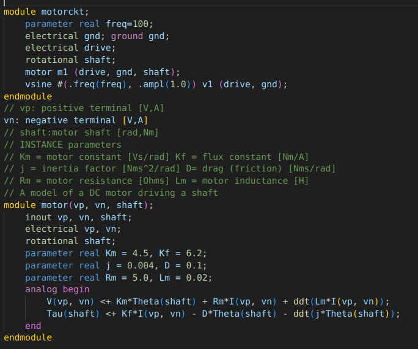
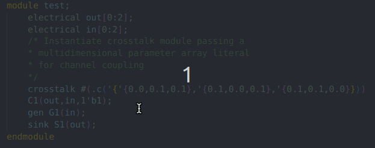
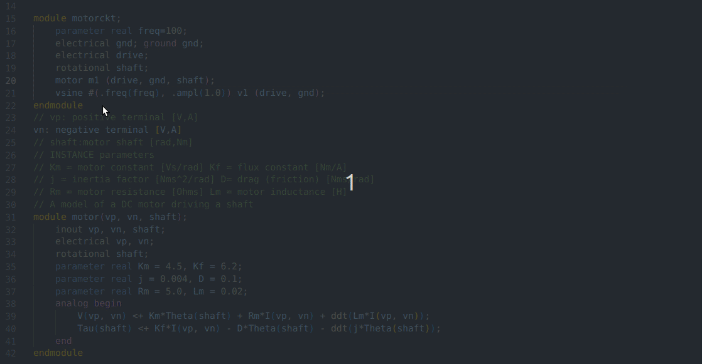

# VerilogA Language Support

This is a Visual Studio Code extension, which provides support for the VerilogA language.
**This extension is still in development.**

*Special thanks to [eirikpre's SystemVerilog Extension](https://github.com/eirikpre/VSCode-SystemVerilog), as it was of greatest help.*

## Features

### Syntax Highlighting

### Hover

### Go To Definition / Reference

## Issues

*NOTE*: As someone who doesn't program in VerilogA at all, I have tried my best to grasp the syntax and rules. Still, I most likely missed some things, so if you see something that is not aligned with standards or doesn't work the way it should, please let me know!

I also appreaciate contribution. If you want to contribute please fork the repository, clone it and make changes, then create a PR.

## Release Notes

See the [changelog](CHANGELOG.md) for more details

## Future
- Better hover information.
- Fix *(all)* bugs *(is that even possible?)*
- Compile with OpenVAF
- more grammar information